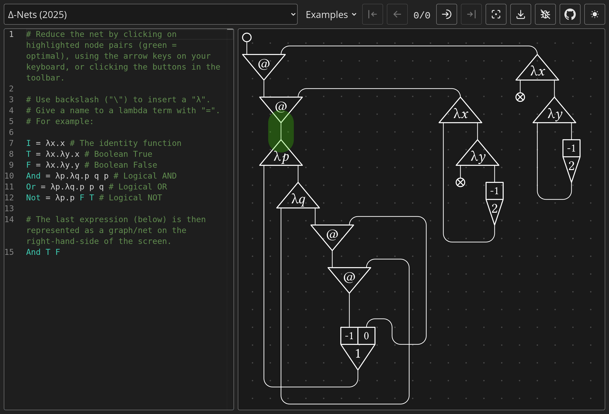

# ∆-Nets: Interaction-Based System for Optimal Parallel λ-Reduction

Research Paper: https://arxiv.org/abs/2505.20314

Interactive Demo: https://deltanets.org

This repository contains source code for the ∆-Nets [interactive demo](https://deltanets.org).
